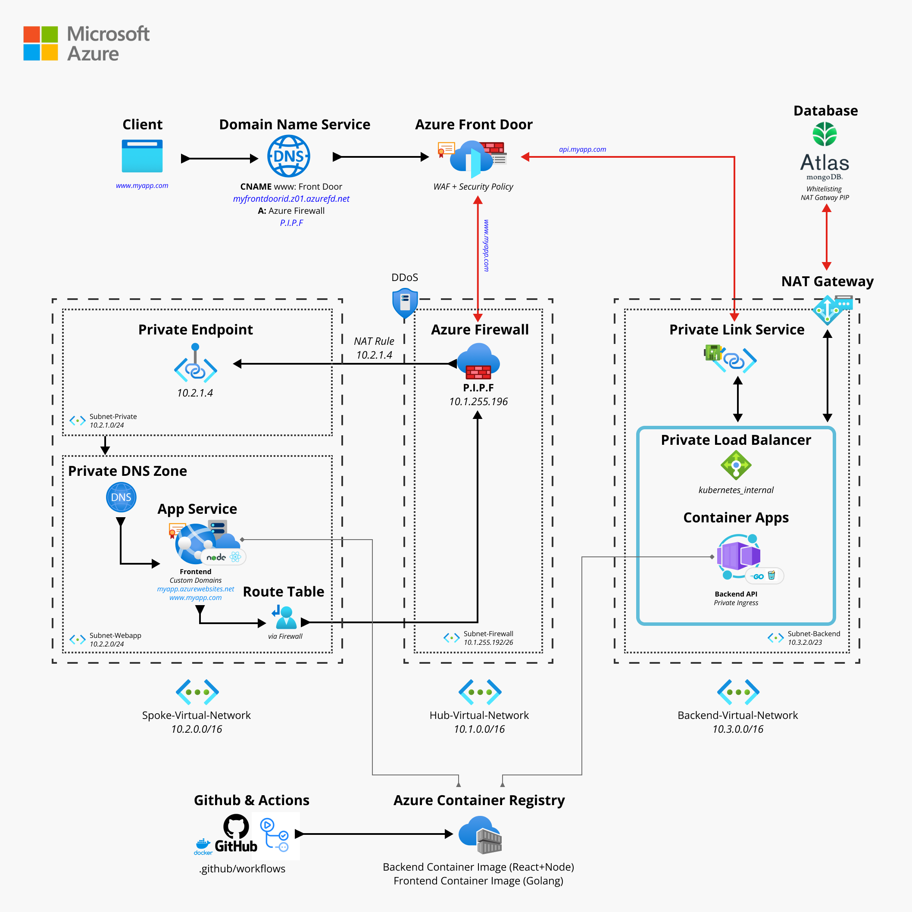

## Motivation
Create a Hands-On workshop to implement Azure Container Apps and FrontDoor as an alternative to AKS.

## Business Application Project 
Introducing the Ultimate Todo App:
A web application that effortlessly displays your todos. With our frontend React App seamlessly connecting to the backend API, your todos are securely saved in a database. Get ready for a whole new level of productivity, accompanied by unbeatable security and scalability. Experience the most secure and available Todo App out there!

## What are we building?



# Tech Stack

## Web App
- Golang - Gin Gonic
- TypeScript - React - Vite
- Node - npm
- Docker Desktop

## Azure Cloud
- [Azure Container Apps](https://learn.microsoft.com/en-us/azure/container-apps/overview)
- [FrontDoor](https://learn.microsoft.com/en-us/azure/frontdoor/front-door-overview)
- [Azure Container Registry](https://learn.microsoft.com/en-us/azure/container-registry/)
- [Private Link](https://learn.microsoft.com/en-us/azure/private-link/private-link-overview)
- [Private DNS Zone](https://learn.microsoft.com/en-us/azure/dns/private-dns-privatednszone)
- [Azure App Service](https://learn.microsoft.com/en-us/azure/app-service/overview)
- [Route Table](https://learn.microsoft.com/en-us/azure/virtual-network/tutorial-create-route-table-portal)
- [Cosmos DB (Mongo)](https://learn.microsoft.com/en-us/azure/cosmos-db/mongodb/introduction)
- [Azure Firewall](https://learn.microsoft.com/en-us/azure/firewall/overview)
- [Hub & Spoke Network](https://learn.microsoft.com/en-us/azure/cloud-adoption-framework/ready/azure-best-practices/hub-spoke-network-topology)

# Prerequitisites
- [ ] Install [Git](https://git-scm.com/download/win) on your machine
- [ ] Please clone this repository to your machine: 
    ```sh
    git clone REPO_URL
    ```
- [ ] Install [Docker Desktop](https://www.docker.com/products/docker-desktop/) for image building.
- [ ] Install the [Azure CLI](https://learn.microsoft.com/en-us/cli/azure/)
- [ ] In case you want to run things locally you will need the following installed:
- Node
- Golang

# Local Development
Run the local *MongoDB instance* by running Docker Desktop.
It can be very helpful to install the [Compass GUI](https://www.mongodb.com/products/compass) for Mongo DB.
Start the mongo db container by running:
```sh
cd local-docker
docker-compose up -d
```
Run the *Golang* backend by running the following commands:
```sh
cd api
# Start go application
go run .
```
Run the *React* frontend in a separate terminal by running the following commands:
```sh
cd frontend
# Install npm dependencies
npm install
# Start dev server
npm start
```
You should be able to access the local server on:
[http://localhost:3000](http://localhost:3000)

# Deploying to Azure using the CLI
## Step 1. Create a Resource Group
[Azure resource groups](https://learn.microsoft.com/en-us/azure/cloud-adoption-framework/ready/azure-setup-guide/organize-resources) are a way to organize your resources.
This is very useful if you have multiple projects running and need to organize your resources accordingly. Not to mention rules and tagging.
Run the following commands using Azure CLI:
```sh
# Set Variables: Location & Ressource Group Name
$LOCATION = "westeurope"
$RESOURCE_GROUP = "ACA101-RG"

# Create a Resource Group within our Subscription
az group create -l $LOCATION -n $RESOURCE_GROUP

# See all Resource Groups to verify
az group list
```
## Step 2. Create the Virtual Networks
The Virtual Networks will serve us as a way for our resources to securely communicate with each other, the internet, and on-premises networks.
```sh
$VN_BACKEND = "Backend-Virtual-Network"
$VN_FRONTEND = "Frontend-Virtual-Network"
$VN_HUB = "Hub-Virtual-Network"

# Create a Virtual Network for our Backend
az network vnet create --name $VN_BACKEND --resource-group $RESOURCE_GROUP --location $LOCATION --address-prefixes "10.3.0.0/16" --tags ENV=TEST APP=ACA101 TYPE=BACKEND

# Create a Virtual Network for our Frontend
az network vnet create --name $VN_FRONTEND --resource-group $RESOURCE_GROUP --location $LOCATION --address-prefixes "10.2.0.0/16" --tags ENV=TEST APP=ACA101 TYPE=FRONTEND

# Create a Virtual Network for the Hub
az network vnet create --name $VN_HUB --resource-group $RESOURCE_GROUP --location $LOCATION --address-prefixes "10.1.0.0/16" --tags ENV=TEST APP=ACA101 TYPE=HUB

# Add network peering
$VN_HUB_ID=$(az network vnet show --resource-group $RESOURCE_GROUP --name $VN_HUB --query id --out tsv)
$VN_FRONTEND_ID=$(az network vnet show --resource-group $RESOURCE_GROUP --name $VN_FRONTEND --query id --out tsv)

# Peer Hub to Frontend
az network vnet peering create --name Hub-Frontend-Peering --resource-group $RESOURCE_GROUP --vnet-name $VN_HUB --remote-vnet $VN_FRONTEND_ID --allow-vnet-access --allow-forwarded-traffic

# Peer Frontend to Hub
az network vnet peering create --name Frontend-Hub-Peering --resource-group $RESOURCE_GROUP --vnet-name $VN_FRONTEND --remote-vnet $VN_HUB_ID --allow-vnet-access --allow-forwarded-traffic


```
## Step 3. Azure Container Registry
The [Azure Container Registry](https://azure.microsoft.com/en-us/products/container-registry/) is the place where we will store our container images. Our services can then pull the image we want and deploy it.
```sh
# Name for our registry
$REGISTRY_NAME = "registryaca101acr"

# Create the Container Registry
$ACR = az acr create --resource-group $RESOURCE_GROUP --name $REGISTRY_NAME --sku Basic

# This is the registry server address
$ACR_SERVER = "$REGISTRY_NAME.azurecr.io"

# Log into our Container Registry and see that "Login succeeded"
az acr login --name $REGISTRY_NAME

# Create an Admin User for our registry
az acr update -n $REGISTRY_NAME --admin-enabled true

# Retrieve the ACR Credentials for our Admin User
$ACR_USERNAME = az acr credential show --name $REGISTRY_NAME --query username
$ACR_PASSWORD = az acr credential show --name $REGISTRY_NAME --query passwords[0].value
```

## Step 4. Building container images
In this step we will create the container images based off this project and push them to the azure container registry we created. We will build them using docker,tag them with the registry tag and then push them to azure.
```sh
cd frontend
# Build docker image for frontend (make sure Docker Desktop / docker daemon is running)
docker build -t todo-frontend:latest .

# Build backend
cd backend
docker build -t todo-api:latest .

# Tag Docker images
docker tag todo/frontend:latest $ACR_SERVER/todo-frontend:latest
docker tag todo/api:latest $ACR_SERVER/todo-api:latest

# Push Docker images to Registry
docker push $ACR_SERVER/todo-frontend:latest
docker push $ACR_SERVER/todo-api:latest

# Verify and list your images in the Registry
az acr repository list --name $REGISTRY_NAME --output table

Result
-------------
todo-api
todo-frontend
```
## Step 5. Create Subnets in our Vnets.
```sh
# Our Subnets
$SUBNET_BACKEND = "Subnet-Backend"
$SUBNET_FRONTEND = "Subnet-Frontend"

# Create Subnets within our Virtual Network
az network vnet subnet create --name $SUBNET_BACKEND --resource-group $RESOURCE_GROUP --vnet-name $VN_BACKEND --address-prefixes "10.3.2.0/23" --disable-private-link-service-network-policies true --disable-private-link-service-network-policies true

az network vnet subnet create --name $SUBNET_FRONTEND --resource-group $RESOURCE_GROUP --vnet-name $VN_FRONTEND --address-prefixes "10.2.2.0/24"
```
## Step 6. Create the container app
```sh
# Give the environment a name
$ENV_NAME = "ACAEnv"

# Get the ID from the subnet
$SUBNET_ID = az network vnet subnet show -g $RESOURCE_GROUP -n $SUBNET_BACKEND --vnet-name $VN_BACKEND --query id

# Create a Container Apps Environment
az containerapp env create --name $ENV_NAME --resource-group $RESOURCE_GROUP --infrastructure-subnet-resource-id $SUBNET_ID --internal-only true --location $LOCATION --tags ENV=PROD APP=ACA101 TYPE=BACKEND

# Check the provisioningState and wait (> 5 minutes) until its not "Waiting" anymore and shows "Succeeded"
az containerapp env show --resource-group $RESOURCE_GROUP --name $ENV_NAME --query properties.provisioningState

# <!-- Environment provisioned and state equals "Succeeded" --!>

# Give the container app a name
$ACA_NAME = "aca-backend-api"

# Create the Container App within the Environment
$BACKEND_FQDN = az containerapp create -n $ACA_NAME -g $RESOURCE_GROUP --image "$ACR_SERVER/todo-api:latest" --environment $ENV_NAME --ingress internal --target-port 8080 --registry-server $ACR_SERVER --registry-username $ACR_USERNAME --registry-password $ACR_PASSWORD --min-replicas 1 --query properties.configuration.ingress.fqdn

# Remove "internal" from the FQDN Link
$BACKEND_FQDN = $BACKEND_FQDN.replace('.internal','')
```
# Step 6. Azure Front Door
Time to make our secure Backend accessible using Front Door PREMIUM.
In order to link to our Container Apps we will need a private Link to use the Microsoft Backbone from our Front Door. This makes sure the connection does not go over the public internet.
```sh
# Get the Ressource Group name of our managed aks cluster
$AKS_RG = az group list --tag 'APP=ACA101' --query "[1].name" --out tsv

# Take a look at the internal Load Balancer we have - he is not in our Resource Group but in the one created by ACA
az network lb list --resource-group $AKS_RG --query "[?tags.APP=='ACA101' && name=='kubernetes-internal'].{Name: name, FrontendIP: frontendIPConfigurations[0].id, PrivateIP: frontendIPConfigurations[0].privateIPAddress}"

# Getting the IP Config of our internal kubernetes load balancer
$LB_IP_CONF = az network lb list --resource-group $AKS_RG --query "[?tags.APP=='ACA101' && name=='kubernetes-internal'].frontendIPConfigurations[0].id" --out tsv

# Name of our Private Link
$PLS_NAME = "PLS101"

# Creating the Private Link Service
az network private-link-service create --resource-group $RESOURCE_GROUP --name $PLS_NAME --vnet-name $VN_BACKEND --subnet $SUBNET_BACKEND --location $LOCATION --lb-frontend-ip-configs $LB_IP_CONF --fqdns $BACKEND_FQDN --tags APP=ACA101 ENV=PROD

# Retrieving the ID of the PLS
$PLS_ID = az network private-link-service show --resource-group $RESOURCE_GROUP --name $PLS_NAME --query id --out tsv
```
Creating the FrontDoor instance using our Private Link Service
```sh
$PROFILE = "FrontdoorACA101"
$ENDPOINT_NAME = "apiEndpoint"
$HOSTNAME = $BACKEND_FQDN.replace('https://','')

# Create a Frontdoor instance
az afd profile create -g $RESOURCE_GROUP --profile-name $PROFILE --sku Premium_AzureFrontDoor --tags ENV=PROD APP=ACA101

# Create the Origin Group
az afd origin-group create -g $RESOURCE_GROUP --origin-group-name "api" --profile-name $PROFILE --probe-request-type GET --probe-protocol Http --probe-interval-in-seconds 120 --probe-path / --sample-size 4 --successful-samples-required 3 --additional-latency-in-milliseconds 50

# Add the origin to our origin group
az afd origin create -g $RESOURCE_GROUP --host-name $HOSTNAME --profile-name $PROFILE --origin-group-name api --origin-name api --origin-host-header $HOSTNAME --priority 1 --weight 1000 --enabled-state Enabled --http-port 80 --https-port 443 --enable-private-link true --private-link-resource $PLS_ID --private-link-location $LOCATION --private-link-request-message 'Please approve this request'

# Create an Endpoint in Frontdoor
az afd endpoint create --endpoint-name $ENDPOINT_NAME --profile-name $PROFILE --resource-group $RESOURCE_GROUP --enabled-state Enabled --tags APP=ACA101 ENV=PROD

# Link to Default Domain of Front Door
az afd route create --endpoint-name $ENDPOINT_NAME --forwarding-protocol MatchRequest --https-redirect Enabled --origin-group api --profile-name $PROFILE --resource-group $RESOURCE_GROUP --route-name apiRoute --supported-protocols Https --link-to-default-domain Enabled --enabled-state Enabled
```
# Step 7. Front Door and Private Link Validation
We need to approve and "validate" the Connection to your Private Link from Frontdoor.
```sh
# Get Private Endpoint Connection ID
$PE_CONN_ID = az network private-endpoint-connection list -g $RESOURCE_GROUP -n $PLS_NAME --type Microsoft.Network/privateLinkServices --query [0].id --out tsv

# Approve connection to Private Link from Frontdoor
az network private-endpoint-connection approve --id $PE_CONN_ID --description "Approved"
```
# Step 8. Waiting for FrontDoor
It may take some time to get FrontDoor up & running - your successful API request should return you a valid json.
```sh
# Retrieve the URL for your Front Door
$FRONTDOOR_URL = az afd endpoint list -g $RESOURCE_GROUP --profile-name $PROFILE --query "[].hostName" --out tsv

# Add HTTPS Protocol
$FRONTDOOR_URL = "https://"+$FRONTDOOR_URL

# Make Get Request to the Frontdoor Instance
curl $FRONTDOOR_URL
```
Step 9. Add Firewall to Hub Network

```sh
az network firewall create --name "Firewall" -g $RESOURCE_GROUP --location $LOCATION --tier BASIC --vnet-name $VN_HUB
```

Step 10. Create Static Web App
```sh
$GITHUB_USER_NAME=<YOUR_GITHUB_USER_NAME>
$GITHUB_SOURCE="https://github.com/$GITHUB_USER_NAME/aca101todo"
$BRANCH="master"

# Create Static Web App
az staticwebapp create --name todo-static-web-app --resource-group $RESOURCE_GROUP --source $GITHUB_SOURCE --location $LOCATION --branch $BRANCH --app-location "/frontend" --output-location "/dist" --login-with-github

```

Step 10. Add Private Endpoint to Frontend Virtual Network
```sh
# Create Private Endpoint Subnet
$SUBNET_PE = "Subnet-Private-Endpoint"

# Create Subnet for Private Endpoint
az network vnet subnet create --name $SUBNET_PE --resource-group $RESOURCE_GROUP --vnet-name $VN_FRONTEND --address-prefixes "10.2.1.0/24" --disable-private-link-service-network-policies true


# Create Private Endpoint
az network private-endpoint create --connection-name PE-WebApp --name "PE-Frontend" --location $LOCATION -g $RESOURCE_GROUP --vnet-name $VN_FRONTEND --subnet $SUBNET_PE --tags APP=ACA101 ENV=PROD
```
